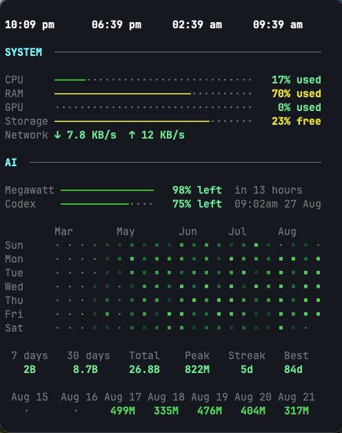

# Stats

A terminal dashboard for macOS system metrics, Amp usage, and Codex usage. It can run directly in a terminal or inside the included native macOS wrapper.



## Features

- CPU, RAM, GPU, storage, and network metrics
- Amp subscription usage
- Codex weekly quota and token activity
- World clocks
- Native macOS window powered by SwiftTerm
- `--once` output for scripts

Stats reads usage through the installed Amp and Codex CLIs. It does not read or store their credentials.

## Requirements

- macOS 11 or newer for the native app
- Rust with Cargo
- Swift 6.2 or newer
- [Amp](https://ampcode.com/) installed and signed in
- [Codex CLI](https://github.com/openai/codex) installed and signed in

## Install

Clone the repository and run:

```sh
./install.sh
```

The installer:

- installs `stats`, `codex-usage`, and `codex-usage-status` in `~/.cargo/bin`
- builds and installs `~/Applications/Stats.app`
- starts the app and enables it at login with a user LaunchAgent

To install only the terminal app, including on other Unix platforms:

```sh
cargo install --path . --locked
```

The AI usage sections require both `amp` and `codex` to be available in `PATH`.

## Usage

```text
stats [OPTIONS]

Options:
      --codex-usage-status
  -i, --interval <seconds>
      --once
      --amp-interval <seconds>
      --privileged-gpu
      --no-privileged-gpu
      --storage-interval <seconds>
  -h, --help
```

Press `q` or Escape to quit the interactive dashboard.

GPU utilization uses `ioreg` by default on macOS. Pass `--privileged-gpu` or set `STATS_PRIVILEGED_GPU=1` to use `powermetrics`; this asks `sudo` to authorize sampling.

## Privacy and security

- Amp and Codex requests are made through their installed CLIs; credentials are not copied into Stats.
- The Codex app server listens only on `127.0.0.1` while Stats is running.
- Parsed usage responses are cached in the operating system's user cache directory (`~/Library/Caches/stats` on macOS). On Unix systems, Stats restricts the directory to the current user (`0700`) and cache files to `0600`.
- Privileged GPU sampling is opt-in. Without it, Stats does not invoke `sudo`.

To report a security issue, see [SECURITY.md](SECURITY.md).

## Development

```sh
cargo fmt --check
cargo clippy --all-targets -- -D warnings
cargo test --locked
swift build --package-path macos
```

## License

[MIT](LICENSE)
